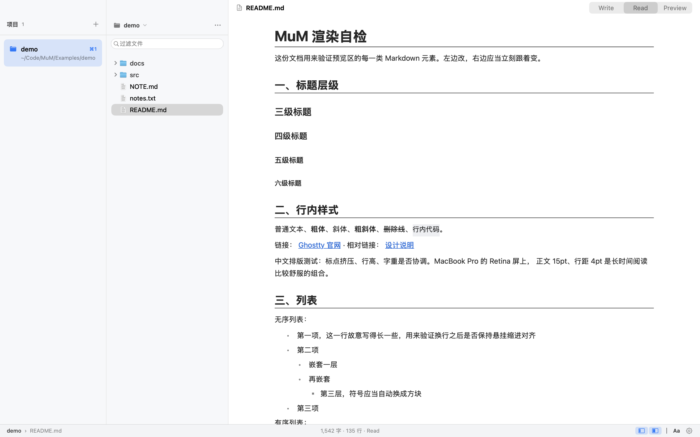
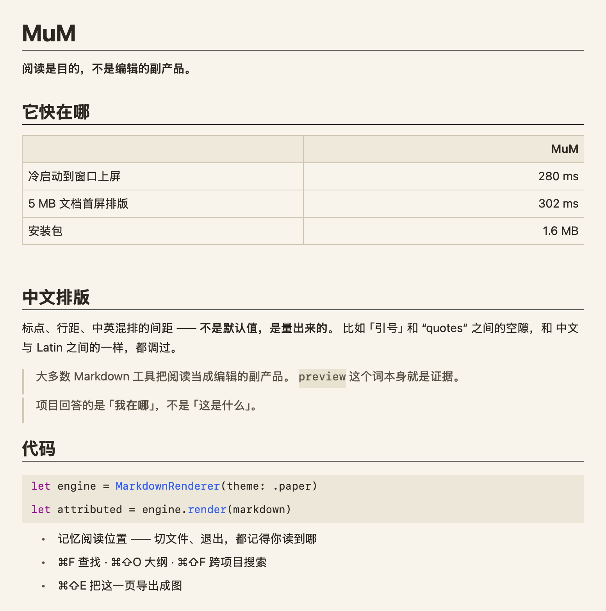

# MuM

**A reading-first Markdown engine.**
**Fast, native — for humans and agents.**

[中文](README.md) ·
[**Download for macOS**](https://github.com/ice5kysl/MuM/releases/download/v0.7.6/MuM-0.7.6.dmg) ·
[Homepage](https://mum.jiker.ai) ·
[Changelog](CHANGELOG.md) ·
MIT

> Signed and notarized — double-click to open, no Gatekeeper dance.
> macOS 14+ · 1.7 MB DMG





*The image above was rendered by MuM itself with `mum render --png` — it's output, not a screenshot.*

---

## Why MuM

- **Fast** — cold start to window in **~260 ms** (measured on the same machine), scrolling a
  5 MB document at **100+ fps**. Speed isn't an optimization goal; it's the identity.
  It has to stay true.
- **Native** — no Web engine anywhere. Markdown is parsed into `NSAttributedString` and
  typeset by hand in AppKit (quote bars, code-block backgrounds and GFM tables are all
  hand-drawn). No Web process means no white flash, no font fallback, no scroll desync.
- **Multi-project** — several projects open at once, `⌘1`…`⌘9` to switch, and **each one
  remembers where you were reading.**
- **Reading is the point** — elsewhere, reading is a by-product of editing (the word
  `preview` is the tell). MuM inverts that: reading is the main line, editing plays support.

## Quick start

```bash
./scripts/run.sh
```

1. **`⌘O` to open a project folder** — open several, switch with `⌘1`…`⌘9`
2. **Click a file in the second pane** — it opens in **Read** (typeset reading) by default;
   switch with `Write / Read / Preview` in the toolbar or `⌥⌘1/2/3`
3. **To edit, switch to Write** — `⌘S` saves; a dot next to the title marks unsaved changes
4. **The gear in the status bar** tunes font size, line spacing and reading theme
   (applies instantly, remembered)

To make MuM the default app for `.md`, see
[“Set as the default editor”](docs/development/build.md).

---

## Usage

### Projects and single files

- **A project is just a folder.** All projects sit side by side in the first pane;
  switching back returns you to the document you were last reading.
- **Opening a lone file** (double-click in Finder, drag in, or `mum file.md`) enters
  **single-file mode** — both sidebars collapse and you just read. The containing folder
  is *not* turned into a project. Opening or switching to a project brings the panes back.

### File management

In the file tree's `···` menu and the right-click menu: **New file (`⌘N`) / New folder /
Rename / Move to Trash**. Next to **Reveal in Finder** (`⇧⌘J`) there's **Open in Terminal** —
it auto-detects your terminal (Ghostty → iTerm → Terminal.app), so a deeply nested
directory is one click away from a shell.

### Finding things

- **`⌘P` Quick Open** — fuzzy-find files by name inside a project
- **`⇧⌘F` Global Search** — filenames and contents across all projects, results stream in
- **`⌘F` Find in document** (`⌘G` / `⇧⌘G` for next/previous); **`⇧⌘O` Outline** jumps by heading
- **`⌘[` / `⌘]`** — back / forward through your reading history

### What it reads

| Format | How it's shown |
| :--- | :--- |
| Markdown | Typeset (headings, lists, tasks, quotes, tables, code highlighting, local images, an inline-HTML whitelist) |
| Source code (swift/py/js…) | Full-document syntax highlighting |
| Plain text (txt/log/subtitles srt/ass/ssa/vtt…) | Monospace layout; GBK encodings detected automatically |
| CSV / TSV | Rendered as tables (still plain text when editing) |
| RTF | Rich-text rendering (read-only) |
| Images / PDF | Native viewers |
| Office / archives / media | Not on the roadmap — you get a page with “Open with default app” and “Reveal in Finder” |

### Export and updates

- **`⌘⇧E` Export** — the body as a tall PNG or a paginated PDF (vector; text stays
  selectable). Page-break hints in the document (`<div style="page-break-after: always">`
  and friends) become real page breaks in the PDF.
- **Updates** — when a new version appears, click “Download update” on the banner:
  the DMG downloads in-app, mounts itself, and you drag MuM into Applications.

### Keyboard shortcuts

| Action | Shortcut |
| :--- | :--- |
| Open project | `⌘O` |
| Switch to project N | `⌘1` … `⌘9` |
| Previous / next project | `⇧⌘[` / `⇧⌘]` |
| Move current project | `⌥⌘[` / `⌥⌘]` |
| Close current project | `⇧⌘W` |
| New file | `⌘N` |
| Quick Open | `⌘P` |
| Global Search | `⇧⌘F` |
| Find in document / Outline | `⌘F` / `⇧⌘O` |
| Previous / next document | `⌘[` / `⌘]` |
| Save / Reload from disk | `⌘S` / `⌘R` |
| Close current file | `⌘W` |
| Export | `⇧⌘E` |
| Refresh file tree | `⇧⌘R` |
| Reveal in Finder | `⇧⌘J` |
| Toggle project list / file tree | `⌘0` / `⌥⌘0` |
| Write / Read / Preview | `⌥⌘1` / `⌥⌘2` / `⌥⌘3` |
| Preview font size | `⌘+` / `⌘-` |
| Full screen | `⌃⌘F` |

Editor behavior: `Tab` inserts two spaces; Return inside a list item continues the marker
(ordered lists increment); Return on an empty item exits the list.

---

## For agents

**The same engine, a second outlet.** No window, no Dock icon, no UI activation:

```bash
mum render doc.md --png out.png --theme paper --dark   # headless render
mum render doc.md --pdf out.pdf
mum outline doc.md --json                              # heading tree
mum search keyword --json                              # cross-project search
mum check  doc.md --json                               # meaningful exit codes
```

Parsing Markdown for an agent is a commodity (cmark is free). **Typesetting it well is
not.** Export (`⌘⇧E`) and the CLI share one rendering entry point — what you see in the
window is pixel-identical to what the agent gets.

Symlink it into your PATH:
`ln -sf /Applications/MuM.app/Contents/Resources/mum /usr/local/bin/mum`

---

## Position among peers

|  | Category | Where MuM stands |
| :--- | :--- | :--- |
| Clearly | Markdown editor for Mac/iOS (sync) | No mobile, different line |
| Lineform | Reading-focused Markdown app | Equally serious typography; MuM leads with **fast + native** |
| Obsidian | Knowledge base (backlinks) | No knowledge management |
| VS Code / Sublime | Code editors (extensible) | No plugin ecosystem |
| **MuM** | **Multi-project Markdown reader** | **Fast + native** — this seat is empty |

---

## Docs

| Want to know | Where |
| :--- | :--- |
| Positioning, criteria, explicit non-goals | [docs/vision.md](docs/vision.md) |
| Technical choices (why no Web engine…) | [docs/design/technical-choices.md](docs/design/technical-choices.md) |
| Build, test, release | [docs/development/build.md](docs/development/build.md) |
| Known limits | [docs/known-limits.md](docs/known-limits.md) |
| Full doc index | [docs/README.md](docs/README.md) |

## Feedback

**MuM is young. The most valuable feedback isn't "what's missing" — it's "where I got stuck."**

→ [**Send feedback / report an issue**](https://github.com/ice5kysl/MuM/issues/new/choose)

**If a file's content was corrupted or lost, say so in the title** — top priority, handled immediately.

## Open source

- **Zero personal information**, no build artifacts in the repo, no `.xcodeproj` —
  `source ./.mumenv && swift build` is all it takes
- **The only third-party dependency is `swift-markdown`** (Apple). No private services,
  no accounts, no telemetry
- Please open an issue before a PR (no plugin system or configuration layer — on purpose)

License: [MIT](LICENSE)。
